# 清理微信僵尸粉控件id文件制作教程

## 使用运行方式二，则以下文件在SD卡的路径为```Android/data/com.l8426936.cleanupwechatzombiefanslauncher/files/CleanUpWeChatZombieFans/```

## 微信更新，控件id和控件文本不变
微信小版本更新，一般控件id和控件文本不会改变，无需制作控件id文件，修改text文件，只需简单修改[config.json](config/config.json)文件即可。

### 修改示例（假设中国版微信下次发布版本为8.0.x）
#### 修改方式一（连续版本建议使用此修改方案）
```
"supported_we_chat_versions": {
    "google_play_store": {
        "min_supported_versions": "7.0.16",
        "max_supported_versions": "8.0.15"
    },
    "other": {
        "min_supported_versions": "7.0.15",
        "max_supported_versions": "8.0.x"
    }
},
"ids_versions": {
    "google_play_store": {
        "7.0.16-7.0.16": "7.0.16.json",
        "7.0.17-7.0.17": "7.0.17.json",
        "7.0.21-7.0.21": "7.0.21.json",
        "8.0.2-8.0.2": "8.0.2.json",
        "8.0.15-8.0.15": "8.0.15.json"
    },
    "other": {
        "7.0.15-7.0.22": "7.0.15.json",
        "8.0.0-8.0.3": "8.0.0.json",
        "8.0.6-8.0.7": "8.0.0.json",
        "8.0.9-8.0.9": "8.0.0.json",
        "8.0.10-8.0.11": "8.0.10.json",
        "8.0.14-8.0.16": "8.0.14.json",
        "8.0.18-8.0.x": "8.0.18.json"
    }
}
```

#### 修改方式二（不连续版本建议使用此修改方案）
```
"supported_we_chat_versions": {
    "google_play_store": {
        "min_supported_versions": "7.0.16",
        "max_supported_versions": "8.0.15"
    },
    "other": {
        "min_supported_versions": "7.0.15",
        "max_supported_versions": "8.0.x"
    }
},
"ids_versions": {
    "google_play_store": {
        "7.0.16-7.0.16": "7.0.16.json",
        "7.0.17-7.0.17": "7.0.17.json",
        "7.0.21-7.0.21": "7.0.21.json",
        "8.0.2-8.0.2": "8.0.2.json",
        "8.0.15-8.0.15": "8.0.15.json"
    },
    "other": {
        "7.0.15-7.0.22": "7.0.15.json",
        "8.0.0-8.0.3": "8.0.0.json",
        "8.0.6-8.0.7": "8.0.0.json",
        "8.0.9-8.0.9": "8.0.0.json",
        "8.0.10-8.0.11": "8.0.10.json",
        "8.0.14-8.0.16": "8.0.14.json",
        "8.0.18-8.0.19": "8.0.18.json",
        "8.0.x-8.0.x": "8.0.18.json"
    }
}
```


## 微信更新，控件id或控件文本改变（假设中国版微信下次发布版本为x.x.x）
### 控件id改变
1. 修改[config.json](config/config.json)文件
```
"supported_we_chat_versions": {
    "google_play_store": {
        "min_supported_versions": "7.0.16",
        "max_supported_versions": "8.0.15"
    },
    "other": {
        "min_supported_versions": "7.0.15",
        "max_supported_versions": "x.x.x"
    }
},
"ids_versions": {
    "google_play_store": {
        "7.0.16-7.0.16": "7.0.16.json",
        "7.0.17-7.0.17": "7.0.17.json",
        "7.0.21-7.0.21": "7.0.21.json",
        "8.0.2-8.0.2": "8.0.2.json",
        "8.0.15-8.0.15": "8.0.15.json"
    },
    "other": {
        "7.0.15-7.0.22": "7.0.15.json",
        "8.0.0-8.0.3": "8.0.0.json",
        "8.0.6-8.0.7": "8.0.0.json",
        "8.0.9-8.0.9": "8.0.0.json",
        "8.0.10-8.0.11": "8.0.10.json",
        "8.0.14-8.0.16": "8.0.14.json",
        "8.0.18-8.0.19": "8.0.18.json",
        "x.x.x-x.x.x": "x.x.x.json"
    }
}
```
2. 在[config/text_id/other/](config/text_id/other/)文件夹下新增文件```x.x.x.json```，格式如下
```
{
    "version": "8.0.18-8.0.19",
    "contacts": "com.tencent.mm:id/f30",
    "labels": "com.tencent.mm:id/kj",
    "label": "com.tencent.mm:id/fh4",
    "contacts_count_by_label": "com.tencent.mm:id/fh3",
    "friend_remark_by_label": "com.tencent.mm:id/(iwg|kpx)",
    "friend_list_by_label": "android:id/list|com.tencent.mm:id/j9w",
    "back_to_label_list": "com.tencent.mm:id/fz",
    "label_list": "com.tencent.mm:id/fh6",
    "friend_list": "com.tencent.mm:id/jr",
    "friend_remark": "com.tencent.mm:id/hga",
    "contacts_count": "com.tencent.mm:id/bml",
    "send_message": "com.tencent.mm:id/khu",
    "friend_details_page_list": "android:id/list",
    "we_chat_id": "com.tencent.mm:id/bq8",
    "account_deleted": "com.tencent.mm:id/bq7",
    "back_to_friend_list": "com.tencent.mm:id/fz",
    "switch_message_type": "com.tencent.mm:id/b7l",
    "more_function_by_transfer": "com.tencent.mm:id/b3q",
    "transfer_function": "com.tencent.mm:id/vg",
    "payee": "com.tencent.mm:id/ino",
    "transfer_amount": "com.tencent.mm:id/lgl",
    "confirm_transfer": "com.tencent.mm:id/ffw",
    "abnormal_message": "com.tencent.mm:id/guv",
    "confirm_abnormal_message": "com.tencent.mm:id/gv3",
    "back_to_chat": "com.tencent.mm:id/fz",
    "back_to_chats": "com.tencent.mm:id/fz",
    "more_function_by_delete": "com.tencent.mm:id/en",
    "more_function_by_delete_list": "android:id/list",
    "delete": "com.tencent.mm:id/khu",
    "confirm_delete": "com.tencent.mm:id/gv3"
}
```
3. 使用```Auto.js```的```布局分析```功能```查看控件信息```，找到控件的```fullId```值，修改控件在json文件中对应的key的value为```fullId```的值即可，如下图示例中的```fullId```值的```com.tencent.mm:id/f30```

#### 示例
<div>
    
    
</div>

#### json文件key对应的控件
| key | className | 位置 | 测试好友功能 | 删除好友功能 | 导入好友（标签列表）功能 | 导入好友（好友列表）功能 | 备注 |
|:---:|:---:|:---:|:---:|:---:|:---:|:---:|:---:|
| version |  |  | 非必需 | 非必需 | 非必需 | 非必需 |  标记可用的微信版本范围 |
| contacts | android.widget.TextView | 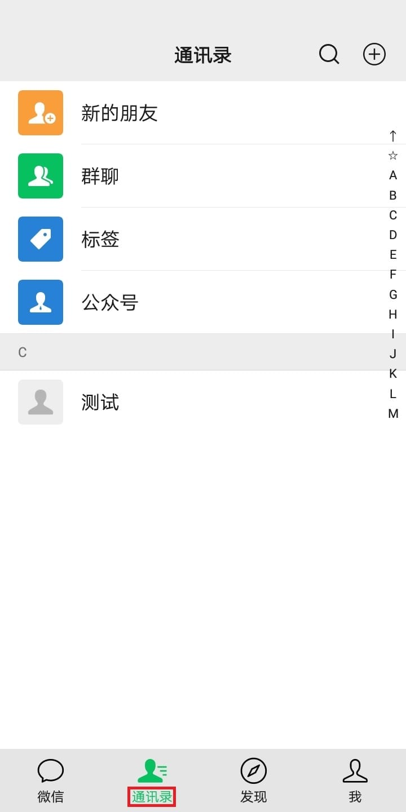 | 必需 | 必需 | 必需 | 必需 |  |
| labels | android.widget.TextView | 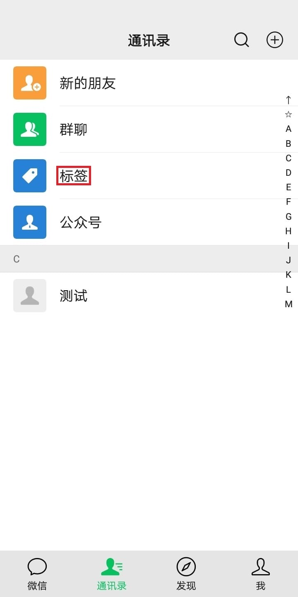 | 非必需 | 非必需 | 必需 | 非必需 |  |
| label | android.widget.TextView |  | 非必需 | 非必需 | 必需 | 非必需 |  |
| contacts_count_by_label | android.widget.TextView |  | 非必需 | 非必需 | 必需 | 非必需 |  |
| friend_remark_by_label | android.widget.TextView |  | 非必需 | 非必需 | 必需 | 非必需 |  |
| friend_list_by_label | android.widget.ListView | 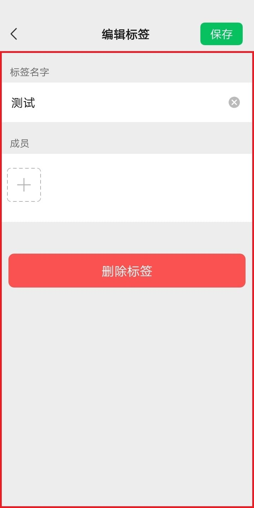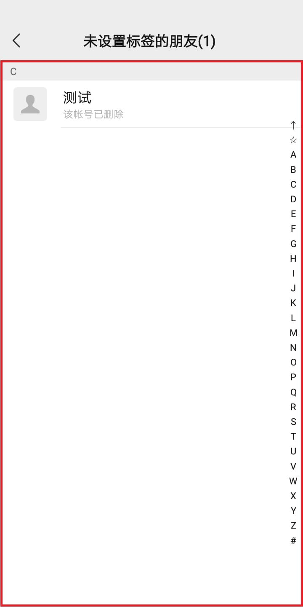 | 非必需 | 非必需 | 必需 | 非必需 | 可使用```Auto.js```的```布局层次分析```功能找到 |
| back_to_label_list | android.widget.Button |  | 非必需 | 非必需 | 必需 | 非必需 |  |
| label_list | androidx.recyclerview.widget.RecyclerView |  | 非必需 | 非必需 | 必需 | 非必需 | 可使用```Auto.js```的```布局层次分析```功能找到 |
| friend_list | androidx.recyclerview.widget.RecyclerView | 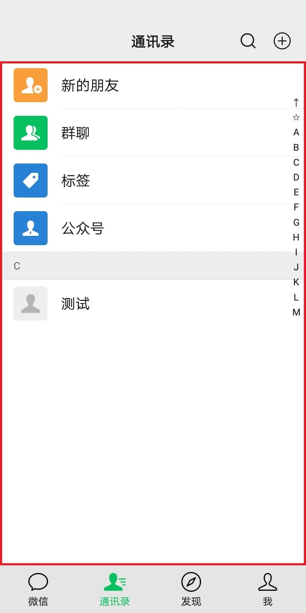 | 必需 | 必需 | 非必需 | 必需 | 可使用```Auto.js```的```布局层次分析```功能找到 |
| friend_remark | android.widget.TextView |  | 必需 | 必需 | 非必需 | 必需 |  |
| contacts_count | android.widget.TextView |  | 必需 | 必需 | 非必需 | 必需 |  |
| send_message | android.widget.TextView | 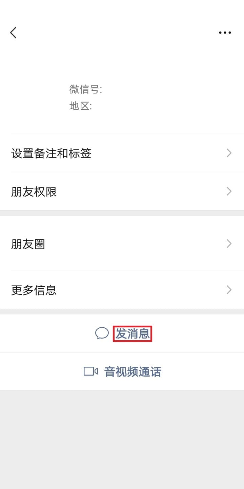 | 必需 | 非必需 | 非必需 | 非必需 |  |
| friend_details_page_list | android.widget.ListView | 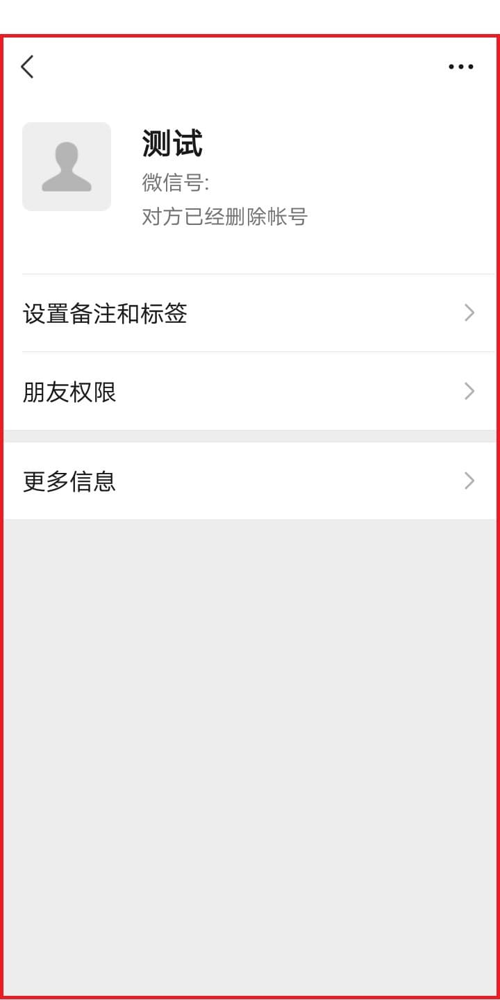 | 必需 | 必需 | 非必需 | 非必需 | 可使用```Auto.js```的```布局层次分析```功能找到 |
| we_chat_id | android.widget.TextView |  | 必需 | 必需 | 非必需 | 非必需 |  |
| account_deleted | android.widget.TextView |  | 必需 | 非必需 | 非必需 | 非必需 |  |
| back_to_friend_list | android.widget.Button |  | 必需 | 必需 | 非必需 | 非必需 |  |
| switch_message_type | android.widget.ImageButton | 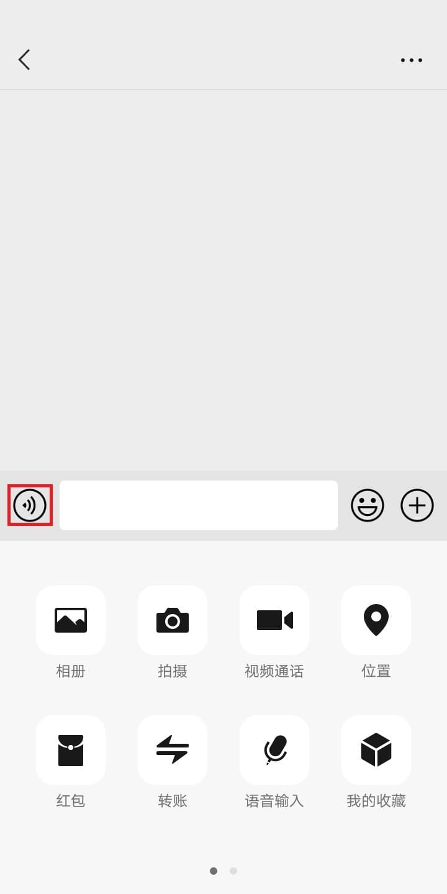 | 必需 | 非必需 | 非必需 | 非必需 |  |
| more_function_by_transfer | android.widget.ImageButton |  | 必需 | 非必需 | 非必需 | 非必需 |  |
| transfer_function | android.widget.TextView |  | 必需 | 非必需 | 非必需 | 非必需 |  |
| payee | android.widget.TextView |  | 必需 | 非必需 | 非必需 | 非必需 |  |
| transfer_amount | android.widget.EditText |  | 必需 | 非必需 | 非必需 | 非必需 |  |
| confirm_transfer | android.widget.Button |  | 必需 | 非必需 | 非必需 | 非必需 |  |
| abnormal_message | android.widget.TextView |  | 必需 | 非必需 | 非必需 | 非必需 |  |
| confirm_abnormal_message | android.widget.Button | 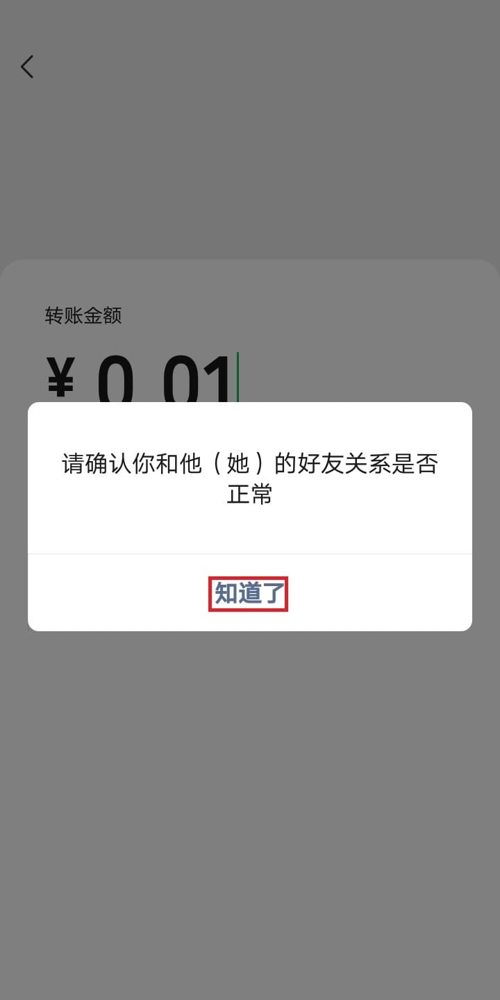 | 必需 | 非必需 | 非必需 | 非必需 |  |
| back_to_chat | android.widget.Button |  | 必需 | 非必需 | 非必需 | 非必需 |  |
| back_to_chats | android.widget.LinearLayout | 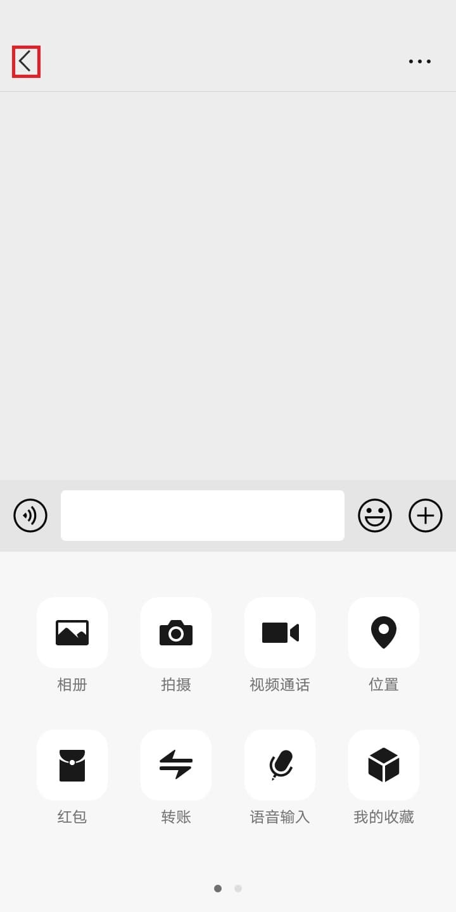 | 必需 | 非必需 | 非必需 | 非必需 |  |
| more_function_by_delete | android.widget.ImageView | 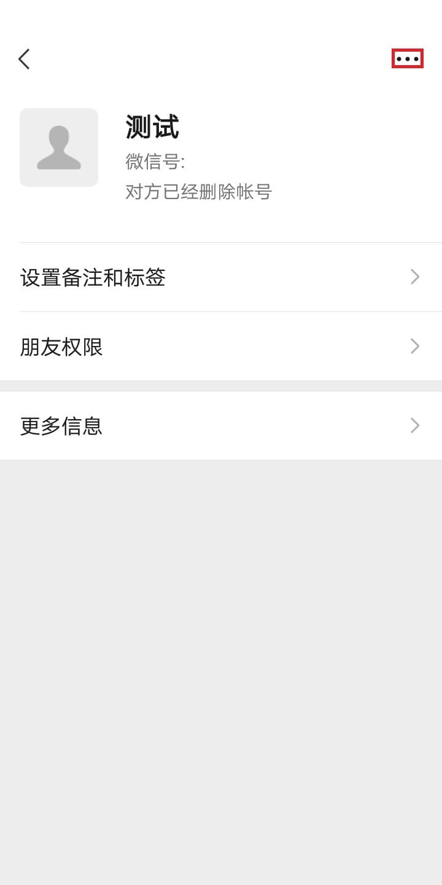 | 必需 | 必需 | 非必需 | 非必需 |  |
| more_function_by_delete_list | android.widget.ListView | 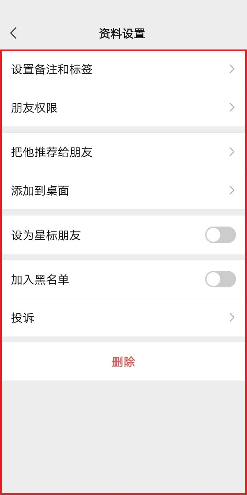 | 非必需 | 必需 | 非必需 | 非必需 | 可使用```Auto.js```的```布局层次分析```功能找到 |
| delete | android.widget.TextView | 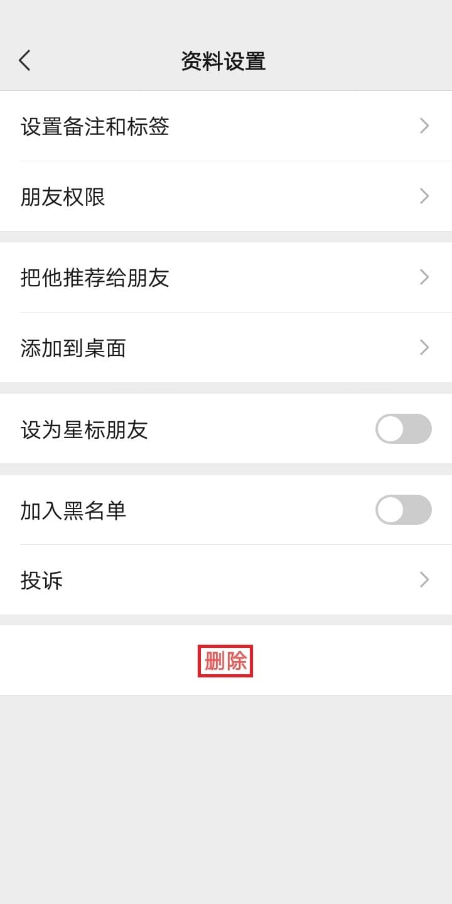 | 非必需 | 必需 | 非必需 | 非必需 |  |
| confirm_delete | android.widget.Button |  | 非必需 | 必需 | 非必需 | 非必需 |  |
--------------------------------------


### 控件文本改变
修改[text.json](config/text_id/text.json)文件
```
{
    "blacklisted_message": "请确认你和他（她）的好友关系是否正常",
    "deleted_message": "你不是收款方好友，对方添加你为好友后才能发起转账",
    "network_error": "网络通信出现问题，请稍后再试",
    "system_error": "系统繁忙，请稍后再试。",
    "cancel_transfer": "取消支付",
    "account_deleted": "对方已经删除帐号",
    "contacts": "通讯录",
    "delete": "删除",
    "close": "关闭(,按钮)?",
    "return": "返回",
    "transfer": "转账",
    "send_message": "发消息",
    "switch_to_voice_message": "切换到按住说话",
    "label": "标签"
}
```
| key | className | 位置 | 测试好友功能 | 删除好友功能 | 导入好友（标签列表）功能 | 导入好友（好友列表）功能 | 备注 |
|:---:|:---:|:---:|:---:|:---:|:---:|:---:|:---:|
| blacklisted_message | android.widget.TextView |  | 必需 | 非必需 | 非必需 | 非必需 |  |
| deleted_message | android.widget.TextView |  | 必需 | 非必需 | 非必需 | 非必需 |  |
| network_error | android.widget.TextView |  | 必需 | 非必需 | 非必需 | 非必需 |  |
| system_error | android.widget.TextView |  |  必需 | 非必需 | 非必需 | 非必需 |  |
| cancel_transfer | android.widget.Button | 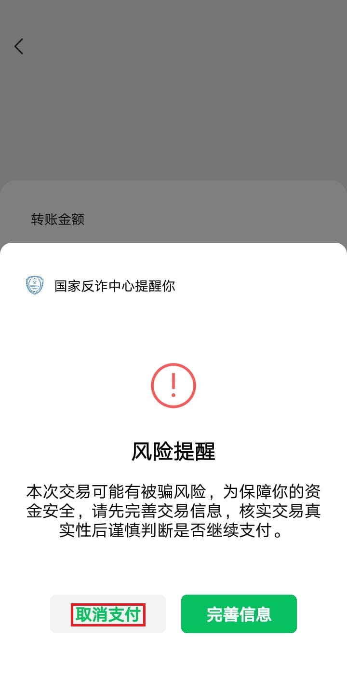 | 必需 | 非必需 | 非必需 | 非必需 | desc属性 |
| account_deleted | android.widget.TextView |  | 必需 | 非必需 | 非必需 | 非必需 |  |
| contacts | android.widget.TextView |  | 必需 | 必需 | 必需 | 必需 |  |
| delete | android.widget.TextView |  | 非必需 | 必需 | 非必需 | 非必需 |  |
| close | android.widget.ViewGroup |  | 必需 | 非必需 | 非必需 | 非必需 | 关闭转账弹窗，desc属性值 |
| return |  |  | 必需 | 非必需 | 非必需 | 非必需 | 关闭转账弹窗，desc属性值 |
| transfer | android.widget.TextView |  | 必需 | 非必需 | 非必需 | 非必需 |  |
| send_message | android.widget.TextView |  | 必需 | 非必需 | 非必需 | 非必需 |  |
| switch_to_voice_message | android.widget.TextView |  | 必需 | 非必需 | 非必需 | 非必需 | desc属性值 |
| label | android.widget.TextView |  | 非必需 | 非必需 | 必需 | 非必需 |  |
--------------------------------------