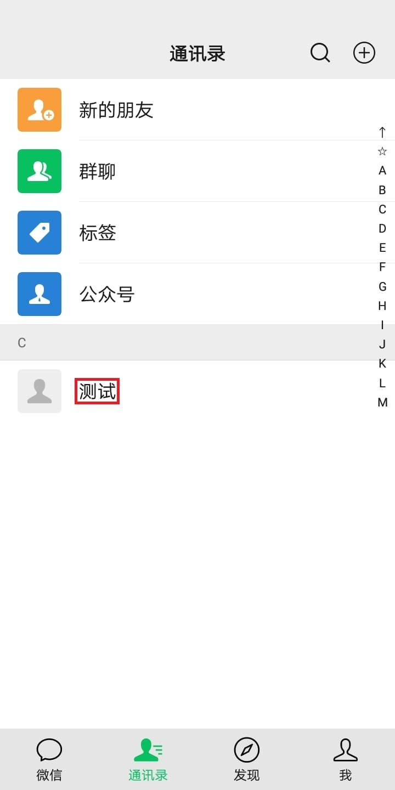

# 模块配置教程

延迟操作的目的是等待动画执行完毕，默认等待时长0.35秒

延迟操作时长可在设置菜单设置，如下图

每个操作步骤的延迟操作只延迟一次，且在控件操作和坐标操作前发生

## 卡在以下图中的哪一步，可在对应的操作步骤勾选坐标操作，延迟操作

### 测试好友模块
| 操作步骤 | 位置 | 备注 |
|:---:|:---:|:---:|
| 点击通讯录 |  |  |
| 点击好友 |  |  |
| 滚动好友列表 |  |  |
| 点击发消息 |  |  |
| 返回好友列表页面 |  |  |
| 滚动好友详情页 |  |  |
| 点击切换到按住说话 |  |  |
| 点击更多功能按钮 |  |  |
| 点击转账功能 |  |  |
| 点击转账 |  |  |
| 关闭支付密码弹窗 |  |
| 确认转账消息弹窗 |  |  |
| 取消支付 |  |  |
| 返回聊天页面 |  |  |
| 返回消息列表页面 |  |  |

### 删除好友模块
| 操作步骤 | 位置 | 备注 |
|:---:|:---:|:---:|
| 点击通讯录 |  |  |
| 点击好友 |  |  |
| 滚动好友列表 |  |  |
| 返回好友列表页面 |  |  |
| 滚动好友详情页 |  |  |
| 点击更多功能按钮 |  |  |
| 点击删除功能 |  |  |
| 滚动更多功能页面 |  |  |
| 确认删除 |  |  |

### 好友列表模块
| 操作步骤 | 位置 | 备注 |
|:---:|:---:|:---:|
| 点击通讯录 |  |  |
| 导入好友备注 |  | 控件操作和坐标操作对此步骤无效 |
| 滚动好友列表 |  |  |

### 标签列表模块
| 操作步骤 | 位置 | 备注 |
|:---:|:---:|:---:|
| 点击通讯录 |  |  |
| 通讯录页面点击标签 |  |  |
| 标签列表页面点击标签 |  |  |
| 滚动标签列表 |  |  |
| 导入好友备注 |  | 控件操作和坐标操作对此步骤无效 |
| 滚动好友列表 |  |  |
| 返回标签列表页面 |  |  |