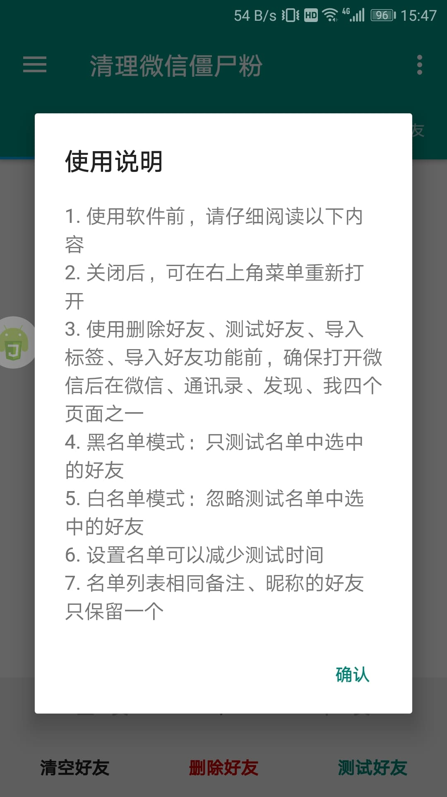
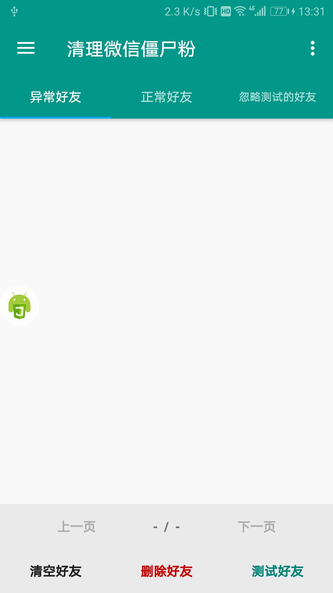
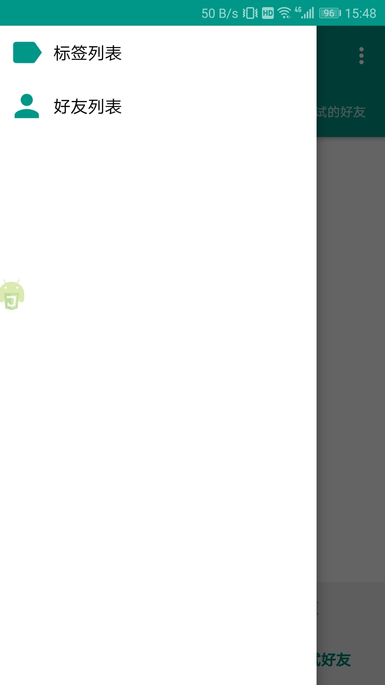
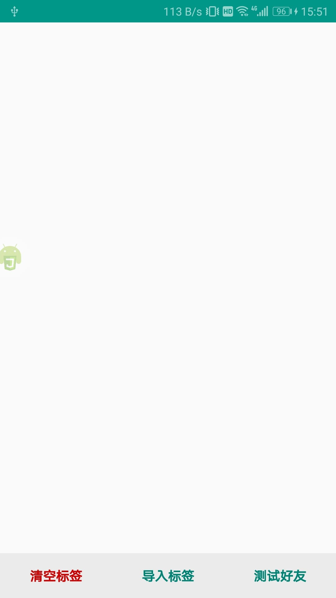
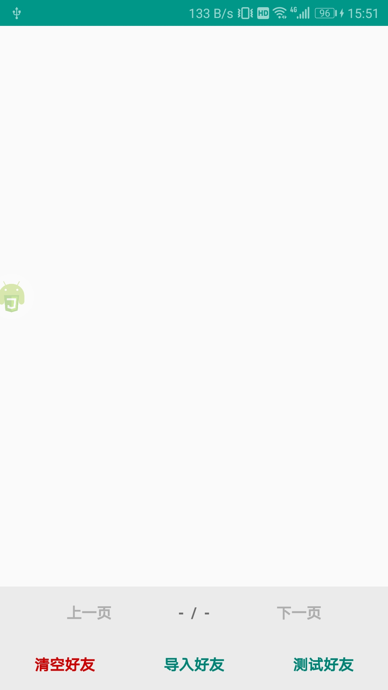
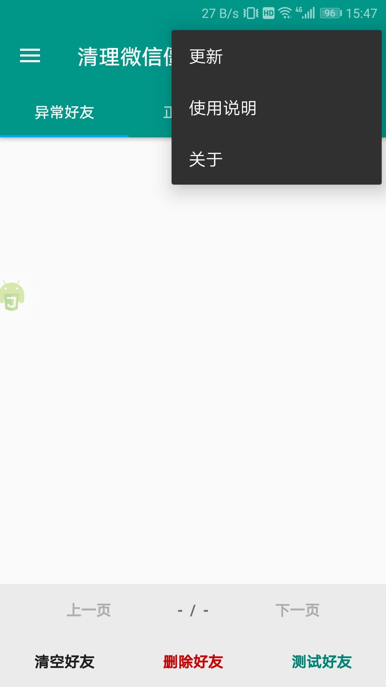

# 清理微信僵尸粉

# 请自行斟酌后使用，一切后果，自行承担，与本人无关。

> 查找被对方删除、拉黑的微信好友
>
> 通过转账前的提示信息判断好友关系

## 功能简介
* 适用中国版微信7.0.15\~7.0.22、8.0.0\~8.0.3、8.0.6\~8.0.7版本
* 适用Google Play Store版微信7.0.16~7.0.17、7.0.21版本
* 仅支持简体中文(zh-CN)
* 检测僵尸粉，支持黑、白名单模式
* 删除好友

## 优势
1. **安全：相较扫码远程登录的清粉方式，操作过程完全可见；扫码登录的清粉方式不能知道对方会拿你的微信号做什么，有极大的安全隐患**
2. **无扰：对方不会收到任何消息**
3. **便捷：相比Xposed、太极等方式，无需刷机、重装微信；简单易用**

## 使用教程（镜像地址可能会有风险网址提醒）
### 运行方式一
1. 安装[Auto.js](https://github.com/SuperMonster002/Hello_Sockpuppet/raw/master/%5Bauto.js%5D%5B4.1.1_alpha2%5D%5Barm-v7%5D(b69a4e23).apk)
2. 下载[CleanUpWeChatZombieFans](https://github.com/L8426936/CleanUpWeChatZombieFans/archive/master.zip)解压到Auto.js的“脚本”文件夹（需要在内存卡根目录手动新建“脚本”文件夹）
3. 运行[main.js](./main.js)
* Github镜像地址：[Auto.js](https://hub.fastgit.org/SuperMonster002/Hello_Sockpuppet/raw/master/%5Bauto.js%5D%5B4.1.1_alpha2%5D%5Barm-v7%5D(b69a4e23).apk)&emsp;[CleanUpWeChatZombieFans](https://hub.fastgit.org/L8426936/CleanUpWeChatZombieFans/archive/master.zip)
### 运行方式二（已知安卓10闪退）
* 下载[最新发布版（GitHub）](https://github.com/L8426936/CleanUpWeChatZombieFans/releases/latest)，安装apk&emsp;[GitHub镜像地址](https://hub.fastgit.org/L8426936/CleanUpWeChatZombieFans/releases/latest)
* 下载[最新发布版（Gitee）](https://gitee.com/L8426936/CleanUpWeChatZombieFans/releases)，安装apk

## 非好友转账微信提示信息
* 被拉黑：请确认你和他（她）的好友关系是否正常
* 被删除：你不是收款方好友，对方添加你为好友后才能发起转账

## 界面截图（versionCode: 29, versionName: 3.5.0）
| 使用说明 | 主界面 | 侧边菜单 | 标签列表 | 好友列表 | 右上角菜单 |
|:----:|:----:|:----:|:----:|:----:|:----:|
|  |  |  |  |  |  |
--------------------------------------

## [同步微信版本教程](Make.md)