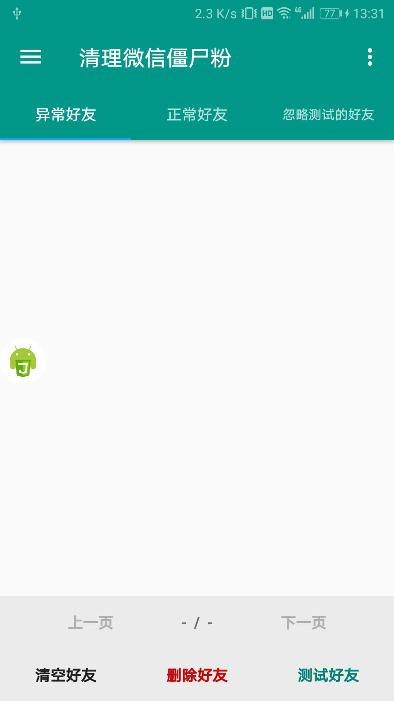

# 清理微信僵尸粉
> 查找被对方删除、拉黑的微信好友
>
> 通过转账前的提示信息判断好友关系

## 非好友转账微信提示信息
* 被拉黑：请确认你和他（她）的好友关系是否正常
* 被删除：你不是收款方好友，对方添加你为好友后才能发起转账

## 支持的语言和微信版本
* 适用微信7.0.9~7.0.17版本
* 仅支持简体中文

## 使用教程
### 运行方式一
1. 安装[Auto.js](https://github.com/SuperMonster002/Hello_Sockpuppet/raw/master/%5Bauto.js%5D%5B4.1.1_alpha2%5D%5Barm-v7%5D(b69a4e23).apk?raw=true)
2. 下载[CleanUpWeChatZombieFans](./)到Auto.js的脚本文件路径
3. 运行[main.js](./main.js)
### 运行方式二
* 下载[最新发布版（GitHub）](https://github.com/L8426936/CleanUpWeChatZombieFans/releases/latest)，安装apk
* 下载[最新发布版（Gitee）](https://gitee.com/L8426936/CleanUpWeChatZombieFans/releases)，安装apk

## 界面截图
| 主界面 | 侧边菜单 | 标签白名单 | 好友白名单 | 右上角菜单 |
|:----:|:----:|:----:|:----:|:----:|
|  |  |  |  |  |
--------------------------------------