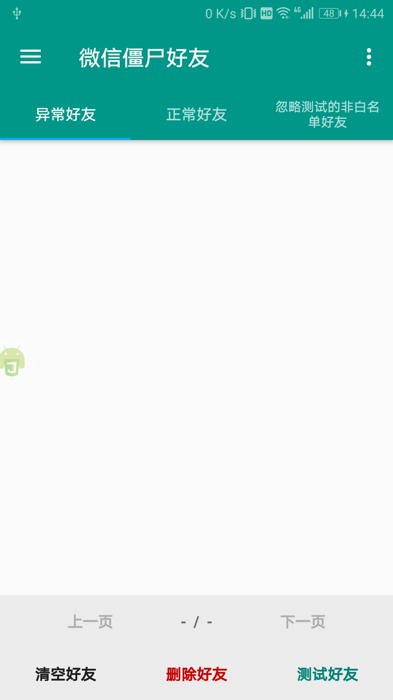
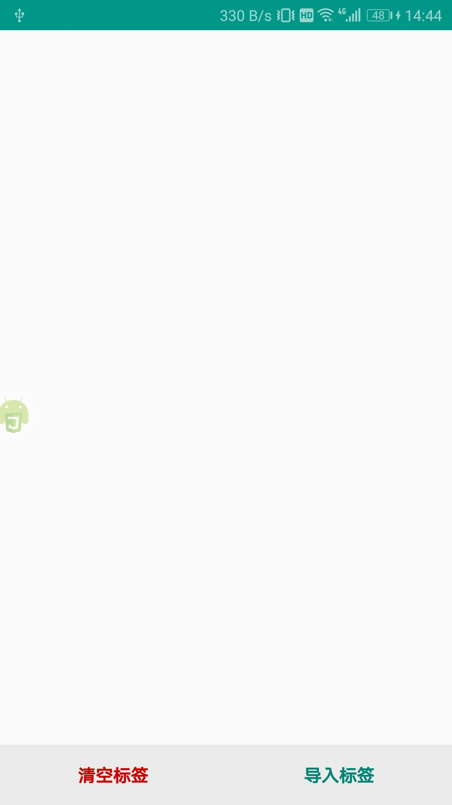
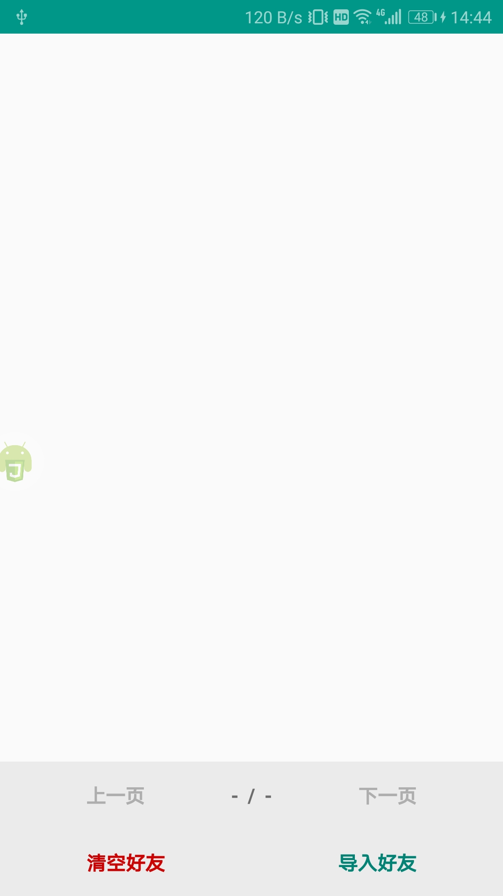
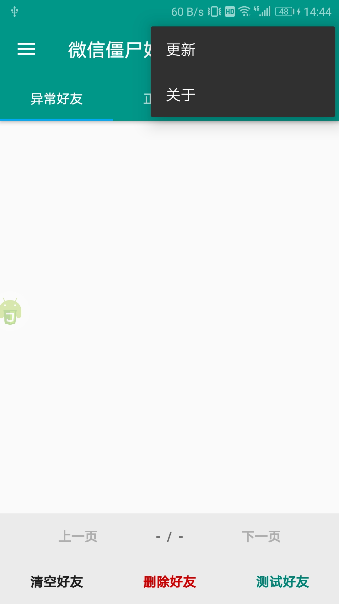
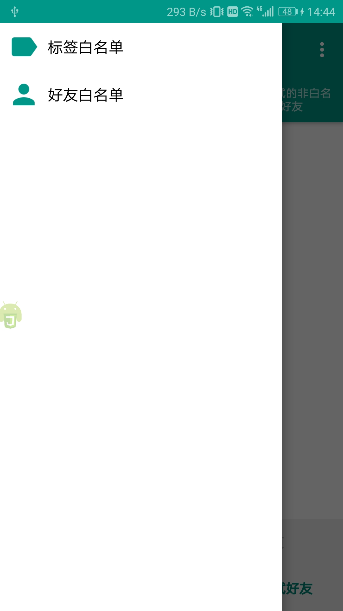

# WeChatZombieFriends

使用教程

## 运行方式一
1. 安装[Auto.js](https://github.com/SuperMonster002/Hello_Sockpuppet/raw/master/%5Bauto.js%5D%5B4.1.1_alpha2%5D%5Barm-v7%5D(b69a4e23).apk?raw=true)
2. 下载[we_chat_zombie_friends](./)到Auto.js的脚本文件路径
3. 运行[main.js](./main.js)

## 运行方式二
* 下载[build](./build/)文件夹下的apk

## 界面截图
| 主界面 | 标签白名单 | 好友白名单 | 右上角菜单 | 侧边菜单 |
|:----:|:----:|:----:|:----:|:----:|
|  |  |  |  |  |
--------------------------------------